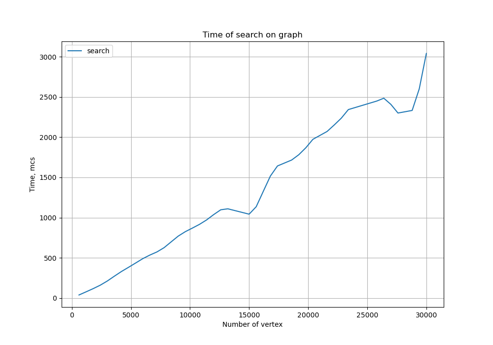
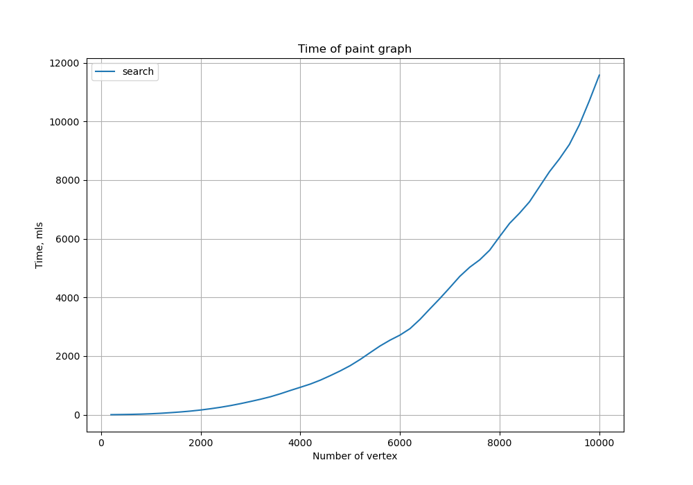
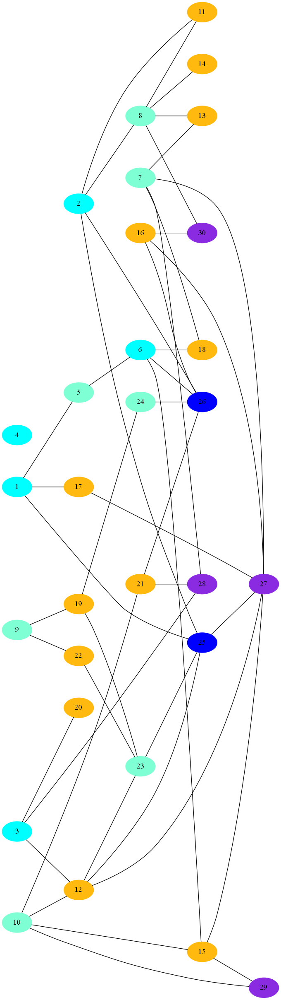
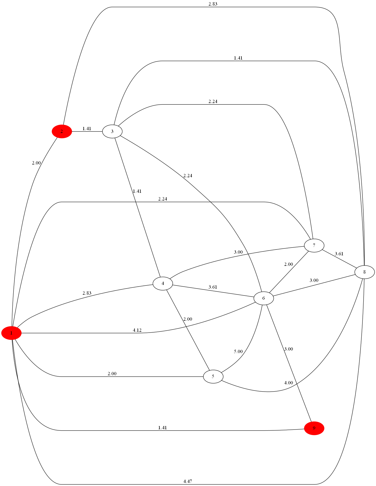

# Графы

Неориентированный граф - 6\
Раскраска графа - 7\
Поиск путей - 5\
Поиск путей на большом графе - 8\
Генерация графов - 10\
Материализация графа - 3\
Использование алгоритма динамического программирования - 10\
Сумма: 49

# График времени работы поиска от количества вершин графа

# График времени работы раскраски графа от количества вершин графа

# Пример раскраски графа из 30 вершин

# Пример поиска пути 
